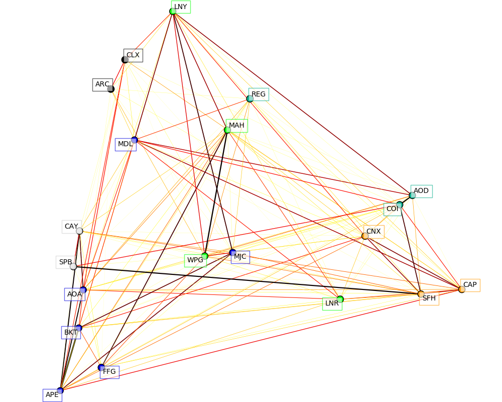
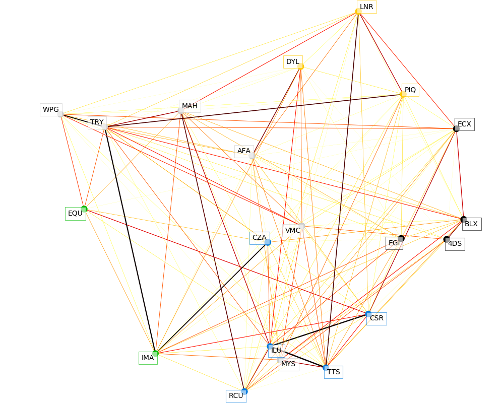

# au\_finance
Inhouse tools and database for computing and visualizing some metrics in the Australian financial market.

## interest\_rate\_model

In this section, the linear model for exchange rates between two arbirary countries is examined using the historical data for US and Australia.

`interest_exchange_rate.db` is a SQLite database that contains the exchange between AUD and other currencies and interest rates of Australia and US up to Jun 2016.

`interestRateAnalyticalModel.py` uses the monthly data Year 1997 and the analytical model below,

$$ \mathrm{ln} \frac{S_n}{S_{n+1}} = \alpha (i_n^{AU} - i_n^{US}) + \beta $$

where $i$ and $S$ is the interest rate and the exchange rate, respectively. $n$ denotes a period and in this particular case, is month.


From the figure above, we can see the strong correlation between the interest rate and the exchange rate, despite the fluctuations in the function of the exchange rate function $\mathrm{ln} \frac{S_n}{S_{n+1}}$. One apparent discrepancy is observed in the year 2008 when a global economic crisis occurred.

## stock

`yahoo_finance.py` contains useful functions to grab data from  and return the result as pandas.DataFrame.

`pplot` can visualise the OHLC and volume data retrieved from <i>Yahoo Finance</i> and analyse with the moving average.

`ASXListedCompanies.pckl` is a pandas.DataFrame that contains the names, symbols and the sectors of the listed companies.

`ASXListedCompanies.xlsx` is the spreadsheet for the same data with a pivot table for different sectors.

```python
def get_histdata(symbol,startDate="1990-01-01",endDate=None)
```
> Grab historical data for a single stock using its code or symbol

```python
def get_selected_hist(stocks)
```
> Grab historical data for some stocks using a list of codes or symbols


`market_structure.py` contains functions to visualize market structures of a collection of stocks. This module requires sklearn (Python machine learning package) to categorise market data. This idea here is to use the daily variation of individual stocks and find out which stocks are usually varying together. By calling `covariance.GraphLassoCV`, we obtain a graphical represenation of the correlation patterns. Then, with `cluster.affinity_propagation` the program automatically decides the number of clusters and print out the results. To visualize the data, we choose to use a 2D representation because it is more human-friendly and with `manifold` the dimension of the data is reduced to 2D.

```python
def discover_clusters(var)
```
> input the covariance and return labels of clusters and partial correlations that can be used in plotting

```python
def get_low_dim_embedding(X, n_neighbors=4)
```
> get a low dimension representation using X as the N by N matrix

```python
def plot_market_structure(names, labels, embedding, partial_correlations)
```
> the plotting function



## dependencies
<mark>*numpy, pandas and scikit-learn*</mark>