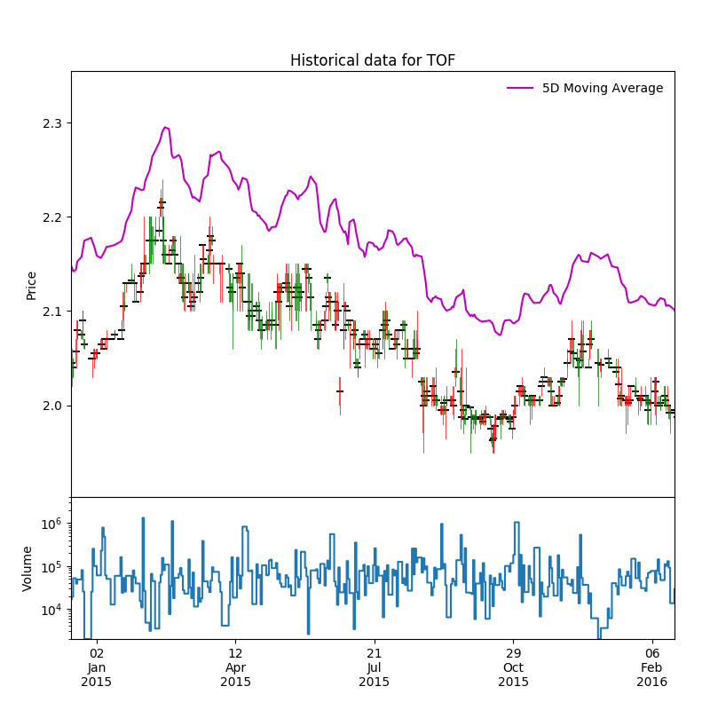

# au\_finance
Inhouse tools and database for computing and visualizing some metrics in the Australian financial market.

## interest\_rate\_model

In this section, the linear model for exchange rates between two arbirary countries is examined using the historical data for US and Australia.

`interest_exchange_rate.db` is a SQLite database that contains the exchange between AUD and other currencies and interest rates of Australia and US up to Jun 2016.

`interestRateAnalyticalModel.py` uses the monthly data Year 1997 and the analytical model below,

\\[ \mathrm{ln} \frac{S_n}{S_{n+1}} = \alpha (i_n^{AU} - i_n^{US}) + \beta\\]

where $i$ and $S$ is the interest rate and the exchange rate, respectively. $n$ denotes a period and in this particular case, is month.


From the figure above, we can see the strong correlation between the interest rate and the exchange rate, despite the fluctuations in the function of the exchange rate function $\mathrm{ln} \frac{S_n}{S_{n+1}}$. One apparent discrepancy is observed in the year 2008 when a global economic crisis occurred.

## stock

`yahoo_finance.py` contains useful functions to grab data from <mark>Yahoo Finance</mark> and return the result as pandas.DataFrame.

`ASXListedCompanies.pckl` is a pandas.DataFrame that contains the names, symbols and the sectors of the listed companies.

`ASXListedCompanies.xlsx` is the spreadsheet for the same data with a pivot table for different sectors.

```python
def get_histdata(symbol,startDate="1990-01-01",endDate=None)
```
> Grab historical data for a single stock using its code or symbol

```python
def get_selected_hist(stocks)
```
> Grab historical data for some stocks using a list of codes or symbols


## dependencies
<mark>*numpy and pandas*</mark>